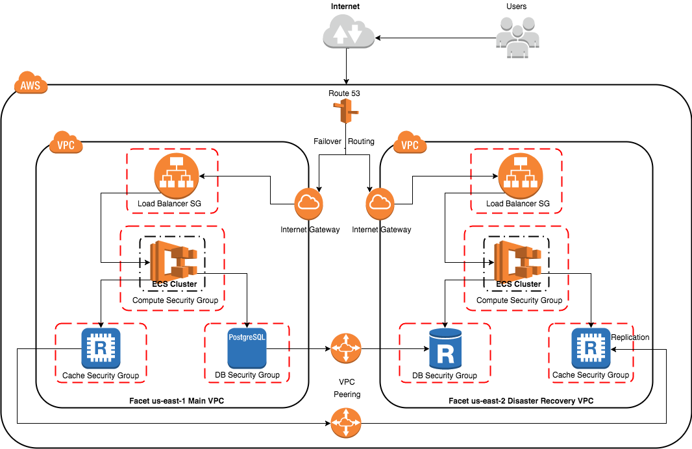

# FACET Post Award

[FACET-Acq](https://github.com/facet-acq/) is Federation of Administration and Contract Entitlement Transactions for Acquisitions. This service is designed to manage the 'post-award' portion of the Procurement-to-Payment business process.

## Scope

This scope includes all elements from the point of award of an agreement or contract through the fulfillment of that agreement, payment of resulting invoices and closeout of the agreement.

## Purpose

In line with the [FACET-Acq](https://github.com/facet-acq/) vision, this service will fill the entitlement and administration need of any large organization desiring an open source alternative to costly monolithic systems.

## Contributing

Contributions are welcome from both technical and business minded individuals, please [review our wiki](https://github.com/facet-acq/post-award/wiki#contributing) and join us!

## Deployment Plan

## Installation

### Development

In development? Great! There are a few options. I personally like the tiered approach.

| Environment | System |
| :--- | :--- |
| Local | Mac/Linux |
| CI | Travis |
| Testing | Docker |
| Production | Docker |

#### IDE and Editors

For an editor, I've recently been leveraging Visual Studio Code a free NodeJS based code editor which provides an excellent feature set and strong extensions for working with PHP and VueJS. As a charting tool, I leverage draw.io desktop.

#### Local

Locally I run the following on my Mac/Linux development environments:

- Zsh
- Git
- Php
- NodeJS
- Laravel Valet
- PostgreSQL
- Redis

While not the most automated setup (with the exception of Valet), I am quite comfortable with these from years of system work. I think the learning opportunities are valuable from working with the software on a more direct level.
